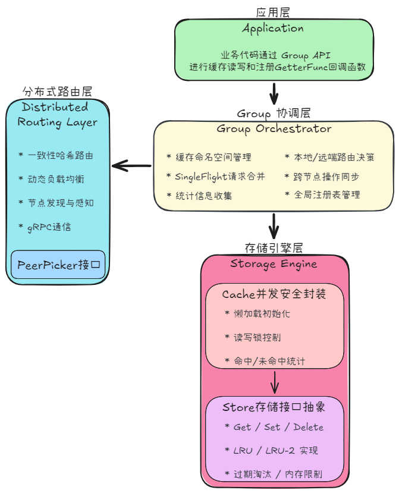

# ReachCache

一个高性能、可嵌入、接口驱动的 Go 分布式缓存库。作为 Go Library 零依赖嵌入业务进程，同时提供丰富的扩展点让你按需定制。

## 特性

- 🚀 高性能 LRU-2 缓存引擎（分段锁 + 索引化链表，消除 GC 扫描压力）
- 🧱 接口驱动架构：实现 `Store` 接口即可替换底层淘汰算法（内置 LRU / LRU-2）
- 🎛️ 函数选项模式（Functional Options）：链式配置 TTL、淘汰策略、缓存上限、淘汰回调等
- 📦 多 Group 命名空间隔离：不同业务线各自独立的缓存区域，互不干扰
- 🌐 一致性哈希路由 + 虚拟节点 + 自适应动态负载均衡
- 🛡️ SingleFlight 请求合并（防缓存击穿，并发请求共享同一回源结果）
- 📡 gRPC + Protobuf 节点间通信（HTTP/2 多路复用 + 二进制序列化）
- 🔍 基于 etcd 的服务注册与发现（Lease 租约 + Watch 实时感知拓扑变化）
- 🔌 可替换路由策略：实现 `PeerPicker` / `Peer` 接口即可接入自定义服务发现
- 🔒 支持 TLS 加密 + Token 认证（UnaryServerInterceptor 拦截）
- 📊 多维度运行时统计（命中率、加载耗时、本地/远端/回源分布）

## 快速开始

### 安装

```bash
go get github.com/vernmorn/reachcache
```

### 单机模式

```go
package main
import reachcache "github.com/vernmorn/reachcache"
func main() {
    group := reachcache.NewGroup("demo", 64<<20,
        reachcache.GetterFunc(func(ctx context.Context, key string) ([]byte, error) {
            return []byte("value for " + key), nil
        }),
    )
    val, _ := group.Get(context.Background(), "hello")
    fmt.Println(val.String())
}
```

### 分布式模式

> 详见 [examples/](examples/) 。

### API 概览

| 函数                                        | 说明                                   |
| ------------------------------------------- | -------------------------------------- |
| `NewGroup(name, maxBytes, getter, opts...)` | 创建缓存组                             |
| `group.Get(ctx, key)`                       | 读取缓存（本地命中 → 远端拉取 → 回源） |
| `group.Set(ctx, key, value)`                | 写入缓存（自动同步到远端节点）         |
| `group.Delete(ctx, key)`                    | 删除缓存                               |
| `group.Stats()`                             | 获取统计信息（命中率、加载耗时等）     |
| `GetGroup(name)` / `DestroyGroup(name)`     | 全局注册表管理                         |
| `NewServer(addr, svcName, opts...)`         | 启动 gRPC 服务端（分布式模式）         |
| `NewClientPicker(addr, opts...)`            | 创建节点选择器（分布式模式）           |

### 配置选项

| 选项                     | 适用   | 说明                  |
| ------------------------ | ------ | --------------------- |
| `WithExpiration(d)`      | Group  | 缓存默认 TTL          |
| `WithPeers(picker)`      | Group  | 启用分布式模式        |
| `WithCacheOptions(opts)` | Group  | 选择 LRU/LRU-2 及参数 |
| `WithTLS(cert, key)`     | Server | 启用 TLS 加密         |
| `WithServerAuthToken(t)` | Server | 节点间认证令牌        |
| ...                      |        |                       |

## 文档

- [架构设计与技术细节](#设计细节) — 本 README 后半部分
- [store 存储引擎](store/README.md)
- [singleflight 请求合并](singleflight/README.md)
- [consistenthash 一致性哈希](consistenthash/README.md)

## Acknowledge

ReachCache 的设计基于和参考了 [groupcache](https://github.com/golang/groupcache) 和 [KamaCache](https://github.com/youngyangyang04/KamaCache-Go)，在此致谢。

## License

Apache License 2.0

---

## 设计细节

### 1. 架构分层

ReachCache系统采用自顶向下的分层架构，共分为四层，各层职责明确、依赖清晰，体现了关注点分离的设计原则：



---

### 2. Store：本地缓存存储引擎

`store` 包定义了统一的缓存存储接口，支持 LRU 和 LRU-2 两种淘汰算法。

**Store 接口**提供 7 个方法：`Get` / `Set` / `SetWithExpiration` / `Delete` / `Clear` / `Len` / `Close`。所有存入缓存的值必须实现 `Value` 接口（`Len() int`），由 `ByteView` 适配。

**LRU**：`container/list` 双向链表 + `map` 哈希表，O(1) 访问。Get 采用二段锁（RLock 查找 + Lock 更新链表位置）将读锁持有时间最小化。过期采用惰性删除 + 定期清理双策略。

**LRU-2**：分段锁（BKDR 哈希 + 位运算取模）+ 两级缓存（L1 频次过滤器 → L2 热数据存储）防止缓存污染。底层使用基于 `uint16` 索引的双向链表替代 `container/list` 实现 LRU，消除指针的 GC 扫描压力；自适应全局时钟将 `time.Now()` 调用频率降低 90%。

```go
// 工厂函数按需创建
cache := store.NewStore(store.LRU, store.NewOptions())
cache2 := store.NewStore(store.LRU2, store.Options{BucketCount: 32, CapPerBucket: 1024})
```

> 详见 [`store/README.md`](store/README.md)。

---

### 3. ByteView：只读数据视图

#### 3.1 设计动机

缓存直接暴露底层字节切片引用时，外部代码可在不通知缓存的情况下修改数据，导致缓存污染。`ByteView` 通过深拷贝机制确保数据不可变性：

```go
type ByteView struct {
    b []byte
}
```

#### 3.2 双层深拷贝保护

| 方向       | 机制                 | 说明                                 |
| ---------- | -------------------- | ------------------------------------ |
| **存储时** | 构造函数深拷贝       | 外部原始切片可被安全修改，不影响缓存 |
| **读取时** | `ByteSlice()` 深拷贝 | 调用方修改返回副本不影响缓存原始数据 |

```go
func (b ByteView) ByteSlice() []byte {
    return cloneBytes(b.b) // 读取时也深拷贝
}

func cloneBytes(b []byte) []byte {
    c := make([]byte, len(b))
    copy(c, b)
    return c
}
```

这种双向隔离确保并发读写混合场景下不会出现数据竞争或数据污染。代价是每次读写需额外内存分配和拷贝，对 KB 级缓存值在可接受范围内。

#### 3.3 Value 接口适配

`ByteView` 实现了 `store.Value` 接口的 `Len()` 方法：

```go
func (b ByteView) Len() int { return len(b.b) }
```

这使得 `ByteView` 可以无缝集成到 `Store` 存储引擎中，存储引擎通过 `Value` 接口操作数据，无需关心具体值类型。

---

### 4. Cache：并发安全封装

`Cache` 是连接上层 `Group` 协调层与底层 `Store` 存储引擎的关键桥梁，提供并发安全外壳、懒加载初始化和统计信息收集。

```go
type Cache struct {
    mu          sync.RWMutex
    store       store.Store
    opts        CacheOptions
    hits        int64
    misses      int64
    initialized int32 // 0=未初始化，1=已初始化
    closed      int32 // 0=运行中，1=已关闭
}
```

**锁层级关系**：

| 层级                                 | 锁             | 保护范围                 |
| ------------------------------------ | -------------- | ------------------------ |
| `Cache.mu`                           | `sync.RWMutex` | `store` 实例的引用和状态 |
| `lruCache.mu` / `lru2Store.locks[i]` | Store 内部锁   | 数据竞争控制             |

两层锁互不干涉，核心理念是**缩小锁粒度**：`Cache` 层仅保护 store 引用，不干涉 Store 内部的数据竞争。

#### 4.1 懒加载初始化

`NewCache` 创建时仅保存配置，不分配底层 Store。首次 `Add` 时通过 `ensureInitialized` 触发初始化：

```go
func (c *Cache) ensureInitialized() {
    // 第一次检查：无锁快速路径
    if atomic.LoadInt32(&c.initialized) == 1 {
        return
    }

    // 第二次检查：持写锁确认
    c.mu.Lock()
    defer c.mu.Unlock()
    if c.initialized == 0 {
        c.store = store.NewStore(c.opts.CacheType, storeOpts)
        atomic.StoreInt32(&c.initialized, 1)
    }
}
```

经典**双重检查锁定（Double-Checked Locking）**模式：第一次检查无锁快速通过（绝大多数请求），第二次检查在写锁下确认防止重复初始化。

设计收益：将昂贵的 Store 分配延迟到真正需要时，减少启动时间和未使用 Group 的内存浪费。

> `Get` 不会触发懒初始化——未初始化的 Cache 永远返回未命中。

#### 4.2 原子操作管理状态

两个 `int32` 原子变量管理生命周期：

| 变量          | 操作                                | 用途                                               |
| ------------- | ----------------------------------- | -------------------------------------------------- |
| `initialized` | `LoadInt32` / `StoreInt32`          | 双重检查锁定的无锁快速路径                         |
| `closed`      | `LoadInt32` / `CompareAndSwapInt32` | 入口快速拒绝 + 持锁后二次校验；CAS 保证 Close 幂等 |

```go
// Get 入口的快速检查（单周期 CPU 指令）
if atomic.LoadInt32(&c.closed) == 1 {
    return ByteView{}, false
}

// 获取锁后二次校验，消除 Close() 在无锁窗口期将 c.store 置 nil 的 TOCTOU 竞态
c.mu.RLock()
if atomic.LoadInt32(&c.closed) == 1 {
    return ByteView{}, false
}

// Close 的幂等保证
if !atomic.CompareAndSwapInt32(&c.closed, 0, 1) {
    return // 已关闭
}
```

#### 4.3 读写锁控制并发访问

| 操作                                                   | 锁类型          | 原因                      |
| ------------------------------------------------------ | --------------- | ------------------------- |
| `Get` / `Add` / `AddWithExpiration` / `Delete` / `Len` | `RLock`（读锁） | 不修改 store 引用，可并发 |
| `Clear` / `Close` / `ensureInitialized`                | `Lock`（写锁）  | 修改 store 引用或状态     |

`Clear` 使用写锁确保清空操作期间无并发读写，同时重置 `hits`/`misses`。

所有操作方法在获取锁后均执行 `closed` 二次校验，防止并发 `Close()` 在无锁窗口期将 `c.store` 置 nil 后引发空指针解引用。

#### 4.4 缓存命中/未命中统计

通过 `atomic.AddInt64` 原子递增：

```go
// 命中
atomic.AddInt64(&c.hits, 1)
// 未命中
atomic.AddInt64(&c.misses, 1)
```

`Stats()` 汇总为可读 map：

| 字段          | 含义                       |
| ------------- | -------------------------- |
| `initialized` | 是否已初始化               |
| `closed`      | 是否已关闭                 |
| `hits`        | 命中次数                   |
| `misses`      | 未命中次数                 |
| `size`        | 当前条目数（仅已初始化时） |
| `hit_rate`    | 命中率 0~1（仅已初始化时） |

---

### 5. Group：缓存命名空间与协调层

Group 是 ReachCache 的核心命名空间抽象，每个 Group 代表一个独立的缓存区域。它统筹本地缓存查询、SingleFlight 并发控制、Getter 数据回源，是系统控制面和数据面的交汇点。

#### 5.1 字段职责

```go
type Group struct {
    name       string              // 唯一标识，全局注册表的键
    getter     Getter              // 数据回源接口
    mainCache  *Cache              // 本地缓存实例
    peers      PeerPicker          // 分布式节点选择器（nil=单机模式）
    loader     *singleflight.Group // 请求合并器
    expiration time.Duration       // 默认 TTL，0=永不过期
    closed     int32               // 原子变量：0=运行中，1=已关闭
    stats      groupStats          // 多维度统计
}
```

#### 5.2 Getter 接口

```go
type Getter interface {
    Get(ctx context.Context, key string) ([]byte, error)
}

type GetterFunc func(ctx context.Context, key string) ([]byte, error)

func (f GetterFunc) Get(ctx context.Context, key string) ([]byte, error) {
    return f(ctx, key)
}
```

借鉴 `http.HandlerFunc` 的适配模式：普通函数通过类型转换即可满足 `Getter` 接口，无需定义新类型。

#### 5.3 三级回源策略（Get 流程）

```text
Group.Get(ctx, key)
  │
  ├─ ① 检查 closed → 已关闭 → ErrGroupClosed
  ├─ ② 查 mainCache → 命中 → localHits++ → 返回
  │
  └─ ③ load() → singleflight.Do(key, loadData)
       │
       ├─ ④ PickPeer(key) → 远端节点 → peerHits++
       └─ ⑤ getter.Get(ctx, key) → loaderHits++
       │
       └─ ⑥ 回写 mainCache → 返回
```

优雅降级：本地命中（微秒级）→ 远端拉取（毫秒级）→ Getter 回调（仅必要时触发）。

#### 5.4 函数选项模式

```go
group := reachcache.NewGroup("users", 128<<20, myGetter,
    reachcache.WithExpiration(10*time.Minute),
    reachcache.WithPeers(myPeerPicker),
    reachcache.WithCacheOptions(reachcache.CacheOptions{
        CacheType: store.LRU2,
    }),
)
```

`GroupOption` 函数类型接收 `*Group` 指针并修改特定字段，新增配置项无需修改 `NewGroup` 签名。

#### 5.5 跨节点同步与 from_peer 防护

Set/Delete 采用"先本地、后远端、异步同步"模式：本地写入同步完成后，通过后台 goroutine 异步调用远端节点。

两道防线防止无限循环：

- **isSelf 检查**（稳态：所有节点的哈希环一致）：`syncToPeers` 通过一致性哈希判断 key 是否属于本节点
- **from_peer 标记**（纵深防御）：gRPC 服务端对所有入站请求统一打标记，防止集群拓扑变更的瞬态哈希环不一致时的乒乓同步

> **`from_peer` 的实现演进**：该机制经历了三次迭代。最初使用 context value 对所有 gRPC 请求无条件打标记，这在嵌入式库使用模式下完全成立。当考虑独立 gRPC 服务模式时，发现外部程序的 `Set`/`Delete` 也会被误判为 peer 同步。曾考虑用 gRPC metadata 替代 context value 实现精确区分，但最终认识到问题的根源是系统定位——**分布式缓存系统的 gRPC 端口是节点间同步的内部通道，不应对外部暴露**。配合 token 拦截器（只有缓存节点持有共享令牌）后，`from_peer` 回归简洁的原始形态。核心设计原则：外部业务方应通过嵌入式库模式使用缓存，而非直接与集群建立 gRPC 连接。

#### 5.6 全局注册表

```go
var (
    groupsMu sync.RWMutex
    groups   = make(map[string]*Group)
)
```

生命周期 API：

| 函数                                          | 说明                                         |
| --------------------------------------------- | -------------------------------------------- |
| `NewGroup(name, cacheBytes, getter, opts...)` | 创建并注册，同名覆盖时自动关闭旧实例释放资源 |
| `GetGroup(name)`                              | 按名称查找（读锁）                           |
| `ListGroups()`                                | 返回所有名称                                 |
| `DestroyGroup(name)`                          | `close()` + 从注册表移除                     |
| `DestroyAllGroups()`                          | 销毁全部                                     |

`close()` 为未导出方法，内部自动 Clear + Close store，但不自行从注册表删除（防止 `DestroyGroup` 调用时的锁重入死锁）。

---

### 6. 分布式节点通信与路由

#### 6.1 基于 gRPC 与 Protobuf 的节点通信

节点间通信采用 gRPC + Protobuf，利用 HTTP/2 的多路复用能力和高效二进制序列化。

**Protobuf 协议**（`proto/reachcache.proto`）定义了三个 RPC 方法：

```protobuf
service ReachCache {
  rpc Get(GetRequest) returns (GetResponse);
  rpc Set(SetRequest) returns (SetResponse);
  rpc Delete(DeleteRequest) returns (DeleteResponse);
}
```

响应统一使用 `code` 字段：`0` 成功，`1` Group 不存在，`2` key 不存在，`3` 其他错误。

**gRPC Server**（`server.go`）：

- 实现 `ReachCacheServer` 接口，通过全局 `GetGroup(name)` 查找 Group 并委托
- `Set`/`Delete` 入口统一打 `from_peer` 标记（配合 token 拦截器保证安全）
- 注册 gRPC 健康检查服务（`grpc_health_v1`）
- 支持 TLS 加密和 Token 认证拦截器
- 可选的 HTTP 统计接口（`/stats`、`/stats/all`）
- 优雅停止：`GracefulStop()` 等待请求完成后关闭

**gRPC Client**（`client.go`）：

- 实现 `Peer` 接口，封装到远端节点的长连接
- 非阻塞连接（首次 RPC 时按需建立）
- 支持 `WithClientTLS` 和 `WithClientAuthToken` 选项
- `tokenCreds` 实现 `PerRPCCredentials`，自动在每次 RPC metadata 中注入令牌

**HTTP/2 优势**：多路复用长连接（减少 TCP 连接数）、HPACK 头部压缩、流级别流量控制。

| 部署环境  | 配置                                                      | 说明                  |
| --------- | --------------------------------------------------------- | --------------------- |
| 测试/开发 | 不设置 `AuthToken`                                        | 无认证拦截            |
| 生产环境  | `WithServerAuthToken` + `WithClientAuthToken` + `WithTLS` | Token 认证 + TLS 加密 |

#### 6.2 一致性哈希路由

一致性哈希将整个哈希值空间组织成首尾相接的虚拟环，key 通过二分查找顺时针定位到最近的节点。当节点增减时，仅影响约 `1/N` 的 key，从根本上防止缓存雪崩。

**核心实现**（`consistenthash/`）：

- 每真实节点默认 50 个虚拟节点（`DefaultReplicas=50`），解决数据倾斜
- 默认 `crc32.ChecksumIEEE` 哈希函数，硬件加速（SSE 4.2 `crc32` 指令）
- `sort.Search` 二分查找实现 O(log N) 路由
- 使用 `*int64` 指针绕过 Go map value 不可寻址的限制，原子操作记录请求计数

**动态自适应负载均衡**：

| 机制 | 说明                                                                             |
| ---- | -------------------------------------------------------------------------------- |
| 采样 | `Get` 中 `atomic.AddInt64` 记录每节点请求数                                      |
| 判定 | 总请求 ≥ 1000 且存在节点不均衡度 > 25%                                           |
| 调整 | 过载节点 `new = current / loadRatio`；空闲节点 `new = current × (2 − loadRatio)` |
| 频率 | 后台 goroutine 每秒检查一次                                                      |

> 详见 [`consistenthash/README.md`](consistenthash/README.md)。

#### 6.3 PeerPicker 与 Peer 接口

```go
type PeerPicker interface {
    PickPeer(key string) (peer Peer, ok bool, self bool)
    Close() error
}

type Peer interface {
    Get(group string, key string) ([]byte, error)
    Set(ctx context.Context, group string, key string, value []byte) error
    Delete(ctx context.Context, group string, key string) (bool, error)
    Close() error
}
```

- **`PeerPicker`**：解耦路由策略与业务逻辑，`PickPeer` 返回目标节点、是否找到、是否本地
- **`Peer`**：封装对单个节点的操作，`Client` 是其 gRPC 实现
- **`ClientPicker`**：默认 `PeerPicker` 实现，整合一致性哈希 + gRPC 客户端管理 + etcd 服务发现

---

### 7. 高并发防护与动态服务发现

#### 7.1 SingleFlight 请求合并

针对**缓存击穿**（热点 key 过期瞬间大量并发穿透到后端），SingleFlight 保证同一 key 的并发请求中只有一个执行数据加载，其余阻塞等待共享结果。

**核心实现**（`singleflight/`）：

```go
type call struct {
    wg  sync.WaitGroup
    val interface{}
    err error
}

type Group struct {
    m sync.Map // key → *call
}
```

- 首个请求：`Load` 未命中 → 创建 call → `wg.Add(1)` → `Store(key, c)` → 执行 fn → defer 中 `wg.Done()` + `Delete(key)`
- 后续请求：`Load` 命中 → `wg.Wait()` → 共享 `c.val` / `c.err`
- Panic 恢复：defer 中 recover → 写入错误 → 唤醒等待者 → 重新抛出

**竞态窗口**：`Load`→`Store` 之间存在微小窗口，多个 goroutine 可能同时通过 `Load` 检查。这是乐观并发控制的取舍——极端情况下 fn 多执行 1~2 次，不影响正确性。

> 详见 [`singleflight/README.md`](singleflight/README.md)。

#### 7.2 基于 etcd 的服务注册与发现

**服务注册**（`registry/register.go`）：

- Lease 租约 TTL=10 秒，节点故障后 etcd 自动删除注册信息
- 后台 goroutine 持续 KeepAlive 续约
- 优雅退出时主动 `Revoke` 立即注销
- etcd key 路径格式：`/services/{svcName}/{advertiseAddr}`，value 为节点地址

> **TTL 健康检查的局限性**：etcd 的 Lease 机制只能感知网络连通性，无法区分"进程繁忙但存活"与"进程已崩溃"。如果节点进程发生死锁或 goroutine 泄漏，gRPC 服务可能已无法正常处理请求，但 KeepAlive 续约仍在正常进行。为此，ReachCache 在 gRPC 服务端注册了标准的 `grpc_health_v1` 健康检查服务，外部负载均衡器可据此进行更精细的应用层探测。

**服务发现**（`ClientPicker`）：

- 启动时双阶段协同：`fetchAllServices`（全量拉取）+ `watchServiceChanges`（Watch 增量监听）
- `handleWatchEvents`：PUT 事件 → 从 `event.Kv.Value` 解析节点地址 → 若已有旧连接则先关闭再替换（应对滚动重启与租约残留）→ 创建新 Client + 加入哈希环；DELETE 事件 → 从 `event.Kv.Key` 解析地址 → 检查节点是否在 `clients` 中存在 → 关闭连接 + 移除
- Watch 依赖 etcd v3 客户端库内部的重连机制处理短暂网络波动；若 Watch 遇到永久错误或频道关闭，当前 goroutine 直接退出，不再继续监听（需进程重启或上层重建 `ClientPicker` 恢复服务发现）

> **Watch 事件的可靠性**：etcd Watch 不保证事件不重复——`handleWatchEvents` 中 DELETE 事件检查 `addr` 是否仍在 `clients` 映射中存在，避免对已移除节点重复操作。PUT 事件不做跳过式去重，`set()` 先关闭旧连接再创建新连接，滚动重启和重复事件场景下也能保持连接最新。代码层面未实现显式的断点续传（`WithRev`），Watch 故障后的恢复依赖 etcd 客户端库的自动重连能力。

**节点上下线影响**：新增节点从其他节点各分摊约 `1/N` 的 key，新节点上线时在哈希环上创建 50 个虚拟节点接管相邻区间；下线时其虚拟节点被移除，对应区间由顺时针下一个节点接管，残留在下线节点本地缓存中的数据由 TTL 自然过期淘汰。

> **最终一致性问题**：由于网络延迟，不同节点感知 etcd 变更事件的时间不同，可能在短暂窗口内看到不同的哈希环状态。例如节点 A 在 t₀ 感知到 C 上线，而 B 在 t₁（+50ms）才感知到，这 50ms 内 A 和 B 对某些 key 的归属判断可能不一致。`from_peer` 标记将这种短暂不一致的影响限制在极小窗口内——即使发生了乒乓同步，也仅传播一跳即被截断。

#### 7.3 缓存异常防御体系

| 异常类型     | 成因                          | 防御策略                             | 所在层       |
| ------------ | ----------------------------- | ------------------------------------ | ------------ |
| **缓存穿透** | 查询不存在的数据              | Getter 回调兜底 + SingleFlight 合并  | Group 协调层 |
| **缓存击穿** | 热点 key 过期瞬间大量并发穿透 | SingleFlight 请求合并                | Group 协调层 |
| **缓存雪崩** | 节点增减导致大量 key 映射变化 | 一致性哈希 + 虚拟节点（影响仅 1/N）  | 分布式路由层 |
| **缓存污染** | 批量冷数据扫描挤出热数据      | LRU-2 两级缓存过滤（L1→L2 晋升门槛） | 存储引擎层   |

---

### 8. 单元测试覆盖

#### Cache 测试

| 分类   | 测试                            | 覆盖点                                 |
| ------ | ------------------------------- | -------------------------------------- |
| 懒加载 | `TestCache_LazyInit`            | NewCache 不初始化，首次 Add 触发 init  |
|        | `TestCache_GetBeforeInit`       | 未初始化时 Get 返回 miss，misses++     |
| Get    | `TestCache_Get_Hit`             | 命中返回正确 ByteView，hits++          |
|        | `TestCache_Get_Miss`            | 未命中返回 false，misses++             |
| Add    | `TestCache_Add`                 | 基本写入读取                           |
|        | `TestCache_Add_Update`          | 更新已有 key                           |
| Delete | `TestCache_Delete`              | 删除后不可读                           |
|        | `TestCache_Delete_NonExistent`  | 删除不存在 key 返回 false              |
| Clear  | `TestCache_Clear`               | 清空 + 重置 hits/misses                |
|        | `TestCache_Clear_Uninitialized` | 未初始化 Clear 不 panic                |
| Close  | `TestCache_Closed_Reject`       | Close 后 Add/Get/Delete 全拒绝         |
|        | `TestCache_Close_Idempotent`    | 双重 Close CAS 安全                    |
| Stats  | `TestCache_Stats`               | hits=1, misses=1, hit_rate=0.5, size=1 |
| 并发   | `TestCache_ConcurrentGet`       | 50 goroutine 并发读                    |
|        | `TestCache_ConcurrentAddGet`    | 50 goroutine 读写混合                  |

#### Group 测试

| 分类     | 测试                           | 覆盖点                                  |
| -------- | ------------------------------ | --------------------------------------- |
| Get      | `TestGroup_Get_LocalHit`       | Set → Get 本地命中，localHits=1         |
|          | `TestGroup_Get_LoaderHit`      | 未命中触发 Getter，回写后再次命中       |
|          | `TestGroup_Get_SingleFlight`   | 20 并发同一 key，Getter 恰好调用 1 次   |
|          | `TestGroup_Get_LoaderError`    | Getter 失败时 loaderErrors++            |
| Set      | `TestGroup_Set_Validation`     | 空 key / 空 value / closed 校验         |
|          | `TestGroup_Set_WithExpiration` | TTL 过期后 Get 触发 Getter              |
| Delete   | `TestGroup_Delete`             | 删除后 Get 触发回源                     |
|          | `TestGroup_Delete_Validation`  | 空 key / closed 校验                    |
| Clear    | `TestGroup_Clear`              | Clear 后 Get 触发回源                   |
| Stats    | `TestGroup_Stats`              | localHits=1, localMisses=1, hitRate=0.5 |
| 生命周期 | `TestGroup_Destroy`            | DestroyGroup 后 GetGroup 返回 nil       |
|          | `TestGroup_DoubleDestroy`      | 二次销毁返回 false                      |
|          | `TestGroup_DestroyNonExistent` | 不存在时返回 false                      |
|          | `TestGroup_DestroyAllGroups`   | ListGroups 变空                         |
|          | `TestGroup_NewGroup_Duplicate` | 同名覆盖，旧实例被替换                  |
|          | `TestGroup_ListGroups`         | 返回正确数量                            |
|          | `TestGroup_Close`              | DestroyGroup → closed=1 → Get 报错      |

#### Group 分布式路由测试

| 分类        | 测试                                        | 覆盖点                                     |
| ----------- | ------------------------------------------- | ------------------------------------------ |
| 远端命中    | `TestGroup_Get_RemoteHit`                   | PickPeer → peer.Get 返回数据，peerHits++   |
|             | `TestGroup_Get_RemoteMiss_FallbackToGetter` | peer 失败 → 降级 Getter，peerMisses++      |
|             | `TestGroup_Get_KeyBelongsToSelf`            | self=true → 跳过 peer 直接 Getter          |
|             | `TestGroup_Get_PeerPickerNil`               | peers=nil（单机模式）→ 不调 PickPeer       |
|             | `TestGroup_Get_RemoteHit_BackfillCache`     | 远端数据回填本地缓存，二次 Get 本地命中    |
| Set 同步    | `TestGroup_Set_SyncToPeer`                  | Set 触发异步 syncToPeers → peer.Set 被调用 |
|             | `TestGroup_Set_FromPeer_NoSync`             | ctx 含 from_peer → 不触发 sync             |
|             | `TestGroup_Set_SyncToPeer_IsSelf`           | 归属本节点 → 不向自己同步                  |
| Delete 同步 | `TestGroup_Delete_SyncToPeer`               | Delete 触发异步 syncToPeers → peer.Delete  |
|             | `TestGroup_Delete_FromPeer_NoSync`          | ctx 含 from_peer → 不触发 sync             |

#### gRPC Server/Client 测试

| 分类       | 测试                                 | 覆盖点                                |
| ---------- | ------------------------------------ | ------------------------------------- |
| 基本 RPC   | `TestServerClient_Get`               | Client.Get → Server 返回数据          |
|            | `TestServerClient_Set`               | Client.Set → 数据落入 Server 本地缓存 |
|            | `TestServerClient_Delete`            | Client.Delete → Server key 被删除     |
| 错误码     | `TestServerClient_Get_GroupNotFound` | 不存在的 Group → 返回错误             |
|            | `TestServerClient_Get_GetterFailure` | Getter 失败 → 返回错误                |
| Token 认证 | `TestServerClient_TokenAuth_Valid`   | 正确 Token → 请求通过                 |
|            | `TestServerClient_TokenAuth_Invalid` | 错误 Token → PermissionDenied         |
|            | `TestServerClient_TokenAuth_Missing` | 无 Token → PermissionDenied           |
| 健康检查   | `TestServer_HealthCheck`             | gRPC 健康检查服务可达                 |
| from_peer  | `TestServer_Set_FromPeerInjected`    | Server 在 Set 入参注入 from_peer 标记 |

#### ClientPicker 测试

| 分类       | 测试                                    | 覆盖点                           |
| ---------- | --------------------------------------- | -------------------------------- |
| PickPeer   | `TestPickPeer_Remote`                   | 一致性哈希选中远端节点           |
|            | `TestPickPeer_Self`                     | 选中本节点 → self=true           |
|            | `TestPickPeer_EmptyRing`                | 无节点 → ok=false                |
|            | `TestPickPeer_NoMatchingClient`         | consHash 有节点但 clients 无对应 |
| Watch 事件 | `TestHandleWatchEvents_Delete`          | DELETE 事件 → 节点被移除         |
|            | `TestHandleWatchEvents_Delete_SkipSelf` | Self 节点的 DELETE 事件被跳过    |

#### 其它测试

- [store](store/README.md)
- [singleflight](singleflight/README.md)
- [consistenthash](consistenthash/README.md)

---

### 9. 使用示例

```go
package main

import (
    "context"
    "fmt"
    "time"

    "github.com/vernmorn/reachcache"
)

func main() {
    // 创建 Group（单机模式），配置 64MB 缓存 + 10 分钟 TTL
    group := reachcache.NewGroup("users", 64<<20,
        reachcache.GetterFunc(func(ctx context.Context, key string) ([]byte, error) {
            // 从数据库加载用户信息
            return db.QueryUserByID(ctx, key)
        }),
        reachcache.WithExpiration(10*time.Minute),
    )
    defer reachcache.DestroyGroup("users")

    // 写入
    group.Set(context.Background(), "user:123", []byte(`{"name":"Alice"}`))

    // 读取（命中本地缓存）
    if v, err := group.Get(context.Background(), "user:123"); err == nil {
        fmt.Println(string(v.ByteSlice()))
    }

    // 读取（未命中 → 触发 Getter 回源）
    if v, err := group.Get(context.Background(), "user:456"); err == nil {
        fmt.Println(string(v.ByteSlice()))
    }

    // 统计
    stats := group.Stats()
    fmt.Printf("命中率: %.1f%%\n", stats["hit_rate"].(float64)*100)
}
```
